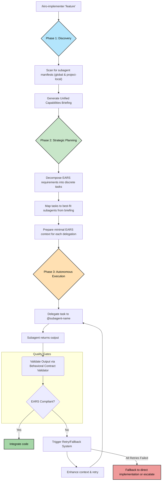
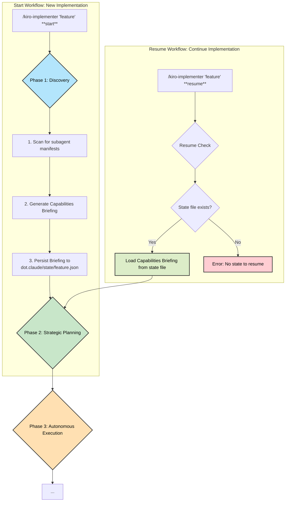

# Enhanced Kiro: Autonomous Subagent Integration System

    
      
    <h3>🤖 Autonomous Specification-Driven Development</h3>
    
<em>An advanced system that transforms the <code>/kiro-implementer</code> into a master agent capable of delegating tasks to a vast collection of specialized subagents, while maintaining strict EARS compliance and full requirement traceability.</em>

    

## 🙏 A Monumental Thank You to the Community

This powerful enhancement would not be possible without the incredible work of community hero **@davepoon**. Their brilliant `claude-code-subagents-collection` forms the backbone of this system.

Please support their invaluable contribution by visiting and starring the original repository:

[**davepoon/claude-code-subagents-collection on GitHub**](https://github.com/davepoon/claude-code-subagents-collection)

---

## 🎯 Overview

The Enhanced Kiro Subagent system elevates the Kiro TAD framework from specification-driven development to **autonomous specification-driven development**. It empowers the `/kiro-implementer` to act as an intelligent orchestrator, analyzing complex tasks, delegating them to the most suitable specialist agents, and validating their output against rigorous EARS behavioral contracts.

This system is composed of several key components that work together to provide a seamless and powerful autonomous workflow.

## 🚀 Core Components

The system's autonomy is powered by four key modules working in concert:

### 1. **Installation & Discovery (`enhance-kiro-subagents.sh`)**
This script is the gateway to unlocking over 280 specialized subagents. It handles the entire setup process, making the vast library of agents available to the system.
-   **One-Command Setup**: Installs the entire subagent collection.
-   **Flexible Installation**: Supports **global** (`~/.claude/agents/`) or **project-specific** (`./.claude/agents/`) locations.
-   **Dynamic Manifest Generation**: Creates a `subagents-manifest.json` file, a "capabilities briefing" that enables sub-200ms discovery of all agents and their specializations.
-   **Enhanced Security**: Validates repository authenticity and file integrity during download.

### 2. **EARS Context Injection (`ears-context-injection.js`)**
This module ensures that subagents receive precise, minimal, and **EARS-compliant** instructions before a task is delegated.
-   **Minimal Context Extraction**: Parses `requirements.md` and `design.md` to extract only the necessary details.
-   **Behavioral Contracts**: Injects specific EARS acceptance criteria (e.g., `WHEN user submits form, SHALL validate within 200ms`) into the subagent's prompt, forming a clear behavioral contract.
-   **Context Caching**: Caches extracted context to optimize performance for subsequent delegations.

### 3. **Delegation, Retry & Fallback (`delegation-retry-fallback.js`)**
This is the brain of the operation, managing the entire lifecycle of a delegated task with a sophisticated retry and fallback mechanism.
-   **Intelligent Delegation**: Matches tasks to the most appropriate subagent based on the manifest.
-   **Progressive Context Enhancement**: If a subagent fails, the system retries by automatically providing more detailed guidance, examples, or simplified requirements.
-   **Graceful Degradation**: If all retries fail, it triggers a fallback strategy, such as switching to a direct implementation mode or escalating to a human developer.
-   **Performance Metrics**: Tracks success rates, retry counts, and fallbacks to provide system insights.

### 4. **Behavioral Contract Validation (`behavioral-contract-validator.js`)**
This engine acts as the quality gate, rigorously validating a subagent's output to ensure it aligns with the original specifications.
-   **EARS Compliance Validation**: Checks the subagent's output against the original EARS behavioral contracts.
-   **Comprehensive Scoring**: Provides an overall validation score, a list of passed contracts, and identifies critical violations.
-   **Actionable Recommendations**: Generates suggestions for fixing violations and improving compliance.
-   **Violation Pattern Tracking**: Identifies common failure patterns to help improve the system and subagent prompts over time.

## 📊 How It Works: The Autonomous Delegation Workflow

The diagram below illustrates the intelligent, multi-stage process the enhanced `/kiro-implementer` uses to execute tasks, from initial discovery to final validation.

## 🔄 State-Aware Resume Capability

The enhanced implementer introduces a crucial `resume` command, allowing it to seamlessly continue an interrupted workflow. This is made possible by persisting the state of the **Discovery** phase.

The diagram below contrasts the `start` workflow with the intelligent `resume` workflow, which bypasses the initial discovery phase by loading the previously saved state.

## ✨ Key Features

-   **Autonomous Execution**: Independently manages the implementation lifecycle for a given task.
-   **Dynamic & Flexible**: Leverages a vast, community-driven collection of subagents.
-   **Resilient & Self-Correcting**: Handles failures gracefully with automated retries and fallbacks.
-   **Traceability & Compliance**: Upholds Kiro TAD principles by linking every action to an EARS requirement.
-   **Enhanced Developer Experience**: Provides clear progress indicators, detailed errors, and automated quality checks.

---

This enhanced subagent system represents a significant leap forward, transforming Kiro into a powerful tool for autonomous, specification-driven software development.