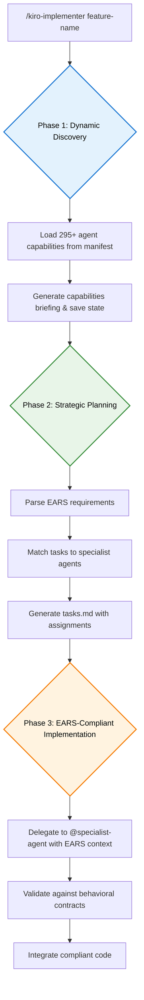

# Enhanced Kiro: Subagent Integration System

<div align="center">
    
    <br><br>
    <h3>🤖 Enhanced Specification-Driven Development</h3>
    <p><em>A powerful system that enhances the <code>/kiro-implementer</code> with access to 295+ specialized subagents from the community, enabling intelligent task delegation while maintaining strict EARS compliance.</em></p>
    


</div>

## 🙏 Special Thanks to @davepoon

This powerful enhancement is made possible by the incredible work of community hero **@davepoon**. Their brilliant `claude-code-subagents-collection` provides the vast library of specialized agents that power this system.

**Please support their invaluable contribution:**
- 🌟 **Star the repository**: [davepoon/claude-code-subagents-collection](https://github.com/davepoon/claude-code-subagents-collection)
- 🙏 Show appreciation for making enhanced AI development possible

---

## 🚀 Quick Start

Get up and running with enhanced subagent capabilities in under 5 minutes:

### 1. Clone the Repository
```bash
git clone https://github.com/your-repo/Enhanced-Kiro-Subagents.git
cd Enhanced-Kiro-Subagents
```

### 2. Run the Installation Script
```bash
./enhance-kiro-subagents.sh
```

### 3. Choose Installation Type
- **Option 1**: Global installation (`~/.claude/agents/`) - Available to all projects
- **Option 2**: Project installation (`./.claude/agents/`) - Current project only

### 4. Start Using Enhanced Features
```bash
/kiro-implementer feature-name
```

That's it! You now have access to 295+ specialized subagents with intelligent discovery and EARS-compliant delegation.

---

## 📋 Prerequisites

Before installation, ensure you have:

- **Claude Code**: The system requires Claude Code to be installed and configured
- **Bash**: Unix shell (macOS/Linux built-in, Windows WSL)
- **Git**: For repository cloning and subagent downloads
- **Network Access**: To download the subagent collection from GitHub
- **100MB+ Free Space**: For the subagent files and supporting assets

---

## 🎯 How It Works: 3-Phase Execution & Core Features

This installation transforms your `/kiro-implementer` with a powerful 3-phase workflow and new capabilities, all designed for performance and traceability.

### The 3-Phase Process

The enhanced implementer follows a structured process for robust and traceable development.

<div align="center">



</div>

*   **Phase 1: Discovery**: Scans the `subagents-manifest.json` to identify all available subagents and their specializations (<200ms). This result is saved to a state file for quick resume.
*   **Phase 2: Planning**: Analyzes EARS requirements, breaks them into tasks, and assigns the best agent for each job in `tasks.md`.
*   **Phase 3: Implementation**: Executes tasks sequentially, delegating to the assigned subagents with full EARS context to ensure compliance.

### Core Features

*   **295+ Specialized Subagents**: Access to the entire @davepoon subagent collection for any task.
*   **EARS-Compliant Delegation**: Injects requirement traceability into every subagent action.
*   **Stateful Resume**: Seamlessly stop and continue your work. The system loads state from `.claude/state/implementer-state/[feature-name].json` to preserve context and agent assignments, skipping the discovery phase on resume.
*   **Enhanced Developer Experience**: Progress indicators, automatic configuration backups, and comprehensive error handling.

---

## 🎮 Usage & Command Workflow

The enhanced implementer introduces commands for managing the implementation lifecycle.

### Command Workflow

```bash
# 1. Start a new feature (discovers agents, creates tasks.md)
/kiro-implementer user-authentication start

# Work on a few tasks, then stop for the day...

# 2. Resume your work (loads state, continues from where you left off)
/kiro-implementer resume user-authentication

# 3. Continue to the next task after one is complete
/kiro-implementer user-authentication continue
```

### Generated `tasks.md` Example

The system analyzes your `requirements.md` and `design.md` to generate a `tasks.md` file like this:

```markdown
# Tasks: User Authentication - Enhanced Implementer

## Progress: 2/4 Complete, 1 In Progress, 1 Not Started

## Phase 1: Foundation Tasks
- [x] **TASK-001: Authentication Schema Design**
  - **Requirement**: REQ-AUTH-001 - User credential validation
  - **EARS AC**: WHEN user submits login, SHALL validate within 200ms
  - **Assigned**: @database-expert
  - **Dependencies**: None

## Phase 2: Implementation Tasks  
- [x] **TASK-002: API Endpoint Implementation**
  - **Requirement**: REQ-AUTH-002 - Login/logout endpoints
  - **EARS AC**: WHEN endpoint called, SHALL return JWT token
  - **Assigned**: @api-designer
  - **Dependencies**: TASK-001

...
```

---

## 🔧 Installation Details

### What Gets Installed

Running `./enhance-kiro-subagents.sh` performs the following:

*   **Subagent Collection**: Downloads 295+ specialized `.md` subagent files to `~/.claude/agents/` or `./.claude/agents/`.
*   **Optimized Manifest**: Creates `subagents-manifest.json` for fast discovery.
*   **Enhanced Kiro Implementer**: Replaces the standard implementer with the enhanced 3-phase version.
*   **Support Files**: Installs required protocols and templates for delegation and discovery.
*   **Safety Backups**: Automatically backs up your existing `kiro-implementer.md` to your Desktop.

### Global vs Project Installation

*   **Global (`~/.claude/agents/`)**: Recommended for individual developers. Agents are available to all projects.
*   **Project (`./.claude/agents/`)**: Recommended for teams. Agents are isolated to the current project and can be version-controlled.

---

## 🔍 Verification & Troubleshooting

### Confirm Installation Success

1.  **Check Agents**: `ls ~/.claude/agents/ | wc -l` (should show 295+ files).
2.  **Verify Manifest**: `cat ~/.claude/agents/subagents-manifest.json | head -5`.
3.  **Test Implementer**: `/kiro-implementer --help` (should show 3-phase execution strategy).

### Common Issues

*   **"Permission denied"**: Make the script executable with `chmod +x enhance-kiro-subagents.sh`.
*   **"Git not found"**: Install git (`brew install git` or `apt-get install git`).
*   **"Network connection failed"**: Check your internet connection and firewall settings.
*   **Recovery**: Your original `kiro-implementer.md` is backed up to your Desktop if you need to restore it.

---

## 🚀 Next Steps & Community

1.  **Explore Available Agents**: Review the manifest or browse `~/.claude/agents/` to see all 295+ specialists.
2.  **Try the Enhanced Implementer**: Start with a simple feature to see the 3-phase process in action.
3.  **Join the Community**: This system is powered by @davepoon's subagent collection. Please support their work!
    -   ⭐ **Star the original repo**: [claude-code-subagents-collection](https://github.com/davepoon/claude-code-subagents-collection)
    -   🐛 Report issues and suggest improvements.
