# Kiro Style Specification-Driven Development for Claude Code

<div align="center">
    
    <br><br>
    <h3>🎯 Intelligent Specification-Driven Development</h3>
    <p><em>A comprehensive system that reproduces the Kiro editor workflow in Claude Code with EARS Hybrid TAD (Traceable Agentic Development) framework, delivering unambiguous requirements, behavioral contracts, and direct test translation.</em></p>
    


<br>

**🤖 For Gemini CLI Users:**
<br>
<a href="example-project/gemini-tools/GEMINI_README.md">
    
</a>
<br>
<em>Experience Kiro's specification-driven development with Google's Gemini CLI</em>

</div>

## 🎯 Concept

Kiro-style specification-driven development is a methodology that advances development centered around three files with **EARS hybrid implementation**, **semantic traceability**, and **AI-powered validation**.

1. **requirements.md** - What to build (EARS Acceptance Criteria with semantic anchoring)
2. **design.md** - How to build it (EARS Behavioral Contracts with ADRs)
3. **tasks.md** - Implementation steps (EARS Definition of Done with bi-directional traceability)

### EARS Hybrid TAD Framework Benefits

- **EARS Precision** - "WHEN user clicks login, system SHALL authenticate within 200ms" vs "fast login"
- **Direct Test Translation** - EARS → BDD (Given/When/Then) automated mapping for comprehensive test coverage
- **Behavioral Contracts** - Component interfaces with exact EARS behavioral expectations
- **Measurable Success** - Every requirement includes specific triggers and quantifiable outcomes
- **Token Efficiency** - Dense, precise EARS statements reduce verbose explanations while improving clarity
- **Semantic Traceability** - AI understands requirement relationships contextually using UUID-based linking
- **Multi-Agent Validation** - Agents verify each other's work automatically with EARS compliance scoring
- **Dynamic Risk Assessment** - Continuous monitoring with EARS-based success criteria
- **Self-Improving System** - Learning system that optimizes estimates and EARS pattern recognition
- **Golden Thread Maintenance** - Requirements → Design → Implementation maintained through EARS traceability
- **Resume Capability** - Seamlessly continue work while preserving full EARS semantic context

## 📊 Kiro TAD Workflow Visualization

### 1. 🎯 Phase 1: Specification Generation Workflow

This diagram shows how Kiro transforms a simple feature request into comprehensive specifications through intelligent Q&A and user approval gates.

```mermaid
graph TD
    A["/kiro 'Feature Name'"] --> B[Pre-Generation Q&A]
    B --> C[Requirements Clarification<br/>Max 3-5 focused questions]
    B --> D[Design Clarification<br/>Max 2-3 technical questions]
    B --> E[Tasks Clarification<br/>Scope & timeline questions]
    
    C --> F[Generate requirements.md]
    D --> F
    E --> F
    
    F --> G[📋 requirements.md<br/>✅ EARS Acceptance Criteria<br/>🔗 Semantic UUIDs<br/>📊 Confidence Scores]
    G --> H{👤 User Approval?}
    H -->|❌ No| I[Revise Requirements]
    I --> H
    H -->|✅ Yes| J[Generate design.md]
    
    J --> K[🏗️ design.md<br/>✅ ADRs with EARS rationale<br/>🔧 Behavioral contracts<br/>📈 API matrix]
    K --> L{👤 User Approval?}
    L -->|❌ No| M[Revise Design]
    M --> L
    L -->|✅ Yes| N[Generate tasks.md]
    
    N --> O[⚡ tasks.md<br/>✅ EARS Definition of Done<br/>🔄 Bi-directional traceability<br/>⚠️ Risk assessment]
    O --> P{👤 User Approval?}
    P -->|❌ No| Q[Revise Tasks]
    Q --> P
    P -->|✅ Yes| R[✨ Ready for Implementation]
    
    style A fill:#e1f5fe
    style G fill:#f3e5f5
    style K fill:#e8f5e8
    style O fill:#fff3e0
    style R fill:#e8f5e8
```



### 2. ⚡ Phase 2: Execution & Smart Completion

This diagram illustrates the controlled task execution process with built-in quality gates and automatic archiving.

```mermaid
graph TD
    A[✨ Specifications Approved] --> B[Auto-Verification Suite]
    B --> C[Forward/Backward<br/>Traceability Check]
    B --> D[Gap Analysis &<br/>Coverage Validation]
    B --> E[Confidence Scoring &<br/>Risk Assessment]
    
    C --> F{🏗️ CLAUDE.md<br/>Update Needed?}
    D --> F
    E --> F
    F -->|Yes| G[Update Project Context]
    F -->|No| H[🚀 Start Task Execution]
    G --> H
    
    H --> I[📝 Execute ONE Task Only]
    I --> J[🔍 Validate Against<br/>EARS Acceptance Criteria]
    J --> K{👤 User Review<br/>& Approval}
    K -->|❌ Issues Found| L[🔧 Fix & Re-validate]
    L --> J
    K -->|✅ Approved| M{📋 More Tasks?}
    M -->|Yes| I
    M -->|No| N[🎯 Smart Completion]
    
    N --> O[Auto-validate ALL<br/>Acceptance Criteria]
    O --> P[🧪 Execute Full Test Suite]
    P --> Q[📊 Generate Quality<br/>Metrics Report]
    Q --> R[📦 Archive to specs/done/<br/>with semantic hash]
    R --> S[🔄 Generate Retrospective<br/>& Update Knowledge Base]
    
    style A fill:#e8f5e8
    style I fill:#fff3e0
    style N fill:#e1f5fe
    style S fill:#f3e5f5
```



### 3. 🧠 EARS Framework Integration

This diagram shows how EARS (Easy Approach to Requirements Syntax) creates unambiguous, testable specifications throughout the TAD process.

```mermaid
graph TD
    A["💭 Vague Requirement<br/>fast login"] --> B["🎯 EARS Transformation"]
    B --> C["📝 WHEN user clicks login<br/>system SHALL authenticate<br/>within 200ms"]
    
    C --> D["🧪 Direct BDD Translation"]
    D --> E["Given user on login page<br/>When user clicks login button<br/>Then system authenticates<br/>within 200ms"]
    
    F["🔧 Component Interface"] --> G["EARS Behavioral Contract"]
    G --> H["// WHEN authenticate called<br/>// SHALL return Promise User<br/>// within 200ms<br/>authenticate(): Promise User"]
    
    I["✅ Task Definition"] --> J["EARS Definition of Done"]
    J --> K["WHEN task completed<br/>SHALL satisfy AC-001<br/>with 100% test coverage<br/>AND performance requirements"]
    
    subgraph Benefits ["EARS Benefits"]
        L["🎯 Eliminates Ambiguity"]
        M["📊 Measurable Outcomes"]
        N["🔗 Direct Test Mapping"]
        O["💾 Token Efficiency"]
    end
    
    style C fill:#e8f5e8
    style E fill:#f3e5f5
    style H fill:#fff3e0
    style K fill:#e1f5fe
```



### 4. 🔄 Resume & Semantic Traceability

This diagram demonstrates the powerful resume capability and how semantic relationships are maintained across the entire development lifecycle.

```mermaid
graph TD
    A["/kiro resume feature-name"] --> B["📖 Read Specifications"]
    B --> C["requirements.md<br/>🔍 Extract semantic UUIDs<br/>📊 Restore confidence scores"]
    B --> D["design.md<br/>🔍 Load ADR decisions<br/>🔗 Reconstruct rationale"]
    B --> E["tasks.md<br/>🔍 Current progress state<br/>⚠️ Risk assessments"]
    
    C --> F["🧠 Reconstruct Full<br/>Semantic Context"]
    D --> F
    E --> F
    
    F --> G["🔗 Rebuild Traceability Graph"]
    G --> H["REQ-UUID-001 links to AC-REQ-ID-01"]
    G --> I["AC-REQ-ID-01 links to TASK-UUID-001"]
    G --> J["TASK-UUID-001 links to Component.method"]
    
    H --> K["✅ Context Fully Restored"]
    I --> K
    J --> K
    K --> L["🚀 Continue Development<br/>with Full Understanding"]
    
    subgraph Links ["Semantic Links Preserved"]
        M["🆔 UUID-based Relationships"]
        N["📊 Confidence Tracking"]
        O["⚠️ Risk Factor Memory"]
        P["🎯 Decision Rationale"]
        Q["🧪 Test Coverage Maps"]
    end
    
    style A fill:#fce4ec
    style F fill:#e1f5fe
    style K fill:#e8f5e8
    style L fill:#f3e5f5
```



## 🚀 How to Use

### Option 1: 🌍 Global Installation (Recommended)

Install Kiro commands globally to use in any project:

```bash
# Clone the repository
git clone https://github.com/bizzkoot/kiro_style_claude_code.git
cd kiro_style_claude_code

# Run global installation script
./install-global.sh

# Clean up
cd .. && rm -rf kiro_style_claude_code
```

**✨ Now use Kiro in any project:**
```bash
cd any-project/
claude
/kiro-init  # Sets up Kiro workflow automatically
```

**🗑️ To uninstall globally:**
```bash
# Download and run uninstaller
curl -sSL https://raw.githubusercontent.com/bizzkoot/kiro_style_claude_code/main/uninstall-global.sh | bash

# Or clone and run locally
git clone https://github.com/bizzkoot/kiro_style_claude_code.git
cd kiro_style_claude_code && ./uninstall-global.sh
cd .. && rm -rf kiro_style_claude_code
```

---

### Option 2: 📁 Per-Project Setup

Choose one of these methods for individual projects:

<details>
<summary><b>Method A:</b> Clone and copy files</summary>

```bash
# Clone the repository
git clone https://github.com/bizzkoot/kiro_style_claude_code.git

# Copy required files to your project directory
cp -r kiro_style_claude_code/example-project/.claude ./
cp kiro_style_claude_code/example-project/CLAUDE.md ./

# Optional: Copy example specifications for reference
# cp -r kiro_style_claude_code/example-project/specs/* ./specs/

# Clean up
rm -rf kiro_style_claude_code
```
</details>

<details>
<summary><b>Method B:</b> Use as a template for a new project</summary>

```bash
# Clone the repository
git clone https://github.com/bizzkoot/kiro_style_claude_code.git

# Copy the entire example project as your starting point
cp -r kiro_style_claude_code/example-project/ my-new-project/
cd my-new-project/

# Clean up
rm -rf ../kiro_style_claude_code
```
</details>

### 🚀 Initialize Claude Code (Per-Project Only)

```bash
# Start Claude Code
claude

# Initialize with Kiro workflow preservation
/init "Please run initialization while preserving the existing CLAUDE.md content. Add project structure details without overwriting the Kiro workflow information."
```

> **💡 Why this matters:** This creates a knowledge base that all `/kiro` commands will use, avoiding redundant project scanning and preserving your workflow setup.

---

## 🎯 Development Workflows

### Option A: 🚀 Full TAD Workflow (One-Command Complete)

<details>
<summary><b>Quick Start - Single Command</b></summary>

```bash
/kiro "Create TODO app"
```

**✨ Creates instantly:**
```
specs/create-todo-app/
├── requirements.md    # 📋 User stories + semantic anchoring + stakeholder analysis
├── design.md         # 🏗️ Technical architecture + ADRs + quality gates  
└── tasks.md          # ✅ Implementation checklist + bi-directional traceability
```

**Perfect for:** Simple features, prototyping, or when you want everything generated at once.

</details>

---

### Option B: 🎯 Specialized Agent Workflow (Recommended)

<details>
<summary><b>Step-by-Step Expert Analysis</b></summary>

#### 🔍 **Step 1: Requirements Research**
```bash
/kiro-researcher "Create TODO app"
```
**🎯 Focus:** Deep requirements analysis with EARS precision
- 👥 Stakeholder mapping & market research
- 🔗 Semantic anchoring with UUID-based linking  
- ⚠️ Edge case identification & business value scoring
- 📊 EARS acceptance criteria (WHEN/WHILE/IF/WHERE + SHALL)
- 🎯 Direct EARS-to-BDD test translation preparation
- 📈 Confidence scoring for all EARS statements

#### 🏗️ **Step 2: Technical Architecture**  
```bash
/kiro-architect "create-todo-app"
```
**🎯 Focus:** Optimal technical design with EARS behavioral contracts
- 📝 Architectural Decision Records (ADRs) with EARS requirement rationale
- 🔧 Component interfaces with EARS behavioral contracts (SHALL statements)
- 🛡️ Security & performance using EARS constraint specifications
- 📈 API Matrix with EARS behavioral specifications instead of generic requirements
- 🎯 Quality Gates with EARS compliance validation criteria

#### ⚡ **Step 3: Implementation Planning**
```bash
/kiro-implementer "create-todo-app"
```
**🎯 Focus:** Detailed execution roadmap with EARS Definition of Done
- 🔄 Bi-directional traceability with EARS acceptance criteria mapping
- 📊 Dependency mapping & critical path analysis
- 🧪 EARS-to-BDD testing strategies & complexity assessments
- ⚠️ Risk mitigation with EARS-compliant resolution criteria
- ✅ Task DoD written in EARS format for precise completion validation
- 🎯 EARS compliance verification checklist for each implementation phase

</details>

**🏆 Benefits of EARS-Enhanced Specialized Agents:**
- 🎯 **EARS Precision** - Each agent delivers unambiguous, testable specifications
- 🧠 **Enhanced Context** - EARS behavioral contracts preserve exact decision rationale  
- 🔗 **Semantic Continuity** - EARS traceability maintains golden thread across phases
- ✅ **AI Validation** - Multi-agent EARS compliance verification & gap detection
- 🧪 **Direct Test Translation** - EARS statements map directly to automated BDD scenarios
- 📊 **Measurable Progress** - Every task completion verifiable against EARS criteria

---

## 🔄 Resume Development (Continue Where You Left Off)

<details>
<summary><b>Resume Any Feature Seamlessly</b></summary>

#### 🚀 **Resume Full Workflow**
```bash
/kiro resume "create-todo-app"
```
Reads **all three files** and reconstructs complete context.

#### 🎯 **Resume Specific Agents**
```bash
# Continue requirements work
/kiro-researcher resume "create-todo-app"

# Continue design work  
/kiro-architect resume "create-todo-app"

# Continue implementation planning
/kiro-implementer resume "create-todo-app"
```

**🎯 Resume Benefits:**
- 🧠 **Full Context** - AI knows WHY decisions were made, not just WHAT
- 🔗 **Semantic Continuity** - Preserves requirement relationships & rationale
- ⚠️ **Risk Awareness** - Maintains risk assessments & mitigation strategies  
- 📊 **Progress Tracking** - Continues from exact pause point

</details>

---

## 📋 Development Process

### ✅ **Review & Approve**
```bash
# Review each phase
"Approve requirements.md"    # ✅ Check stakeholder needs & confidence scores
"Approve design.md"         # ✅ Verify ADR rationale & traceability  
"Approve tasks.md"          # ✅ Confirm implementation plan
```

### 🛠️ **Implement Tasks**
```bash
# Start implementation
"Please implement Task 1"

# Follow the roadmap
"Proceed with development according to tasks.md"
```

### 🔄 **Handle Changes**
When requirements evolve, TAD framework automatically maintains traceability:

```bash
"Add user authentication functionality"
"Change database from PostgreSQL to MongoDB"  
"Remove the dark mode feature"
```

**🤖 Claude automatically:**
- ✅ Updates all related specification files
- 🔗 Maintains semantic traceability links  
- 📊 Recalculates confidence scores & risk assessments
- 📝 Preserves architectural decision rationale

---

## 🐛 Debugging & Issue Resolution

### 🔍 **Natural Language Debugging**
Initiate debugging through conversational interface:

```bash
"I'm seeing an error in the login endpoint"
"The application crashes when loading large files" 
"Why is the authentication failing?"
```

**🎯 EARS-Enhanced TAD Debugging Features:**
- 🔍 **Context-Aware Analysis** - Examines components with EARS behavioral expectation validation
- 🎯 **Root Cause Identification** - Maps issues to specific EARS acceptance criteria failures
- 🛡️ **Risk Assessment** - Evaluates fixes against EARS constraint specifications
- ✅ **Structured Resolution** - EARS Definition of Done for each debug task
- 📝 **Specification Updates** - Updates EARS requirements when debugging reveals gaps
- 🧪 **Measurable Validation** - EARS-to-BDD test scenarios verify complete resolution

### 🗂️ **Debug Specifications**
Creates structured debug specs in `specs/debug-{issue-id}/`:
```
specs/debug-login-error/
├── requirements.md    # 📋 Issue definition + expected resolution
├── design.md         # 🔍 Root cause analysis + solution strategy  
└── tasks.md          # ✅ Investigation + resolution steps
```

### 🔄 **Integration with Development Workflow**
- **Researcher**: Escalates when issues reveal requirement gaps
- **Architect**: Consults when fixes require design changes  
- **Implementer**: Collaborates on significant implementation changes

## 📁 Project Structure

Initial setup with TAD framework:
```
your-project-directory/
├── .claude/
│   └── commands/
│       ├── kiro.md              # Full TAD workflow command
│       ├── kiro-researcher.md   # Requirements specialist with TAD
│       ├── kiro-architect.md    # Design specialist with ADRs
│       ├── kiro-implementer.md  # Implementation specialist with traceability
│       └── debugger.md          # Debugging workflow and issue resolution
└── CLAUDE.md                    # Project rules
```

After running `/kiro "Create TODO app"` with TAD:
```
your-project-directory/
├── .claude/
│   └── commands/
│       ├── kiro.md              # Full TAD workflow command
│       ├── kiro-researcher.md   # Requirements specialist with TAD
│       ├── kiro-architect.md    # Design specialist with ADRs
│       ├── kiro-implementer.md  # Implementation specialist with traceability
│       └── debugger.md          # Debugging workflow and issue resolution
├── CLAUDE.md
└── specs/                 # Created automatically
    └── create-todo-app/   # Feature-specific directory
        ├── requirements.md    # With semantic anchoring and UUIDs
        ├── design.md         # With ADRs and traceability matrix
        └── tasks.md          # With bi-directional requirement mapping
```

After feature completion and archiving:
```
your-project-directory/
├── .claude/
│   └── commands/
│       ├── kiro.md              # Full TAD workflow command
│       ├── kiro-researcher.md   # Requirements specialist with TAD
│       ├── kiro-architect.md    # Design specialist with ADRs
│       ├── kiro-implementer.md  # Implementation specialist with traceability
│       └── debugger.md          # Debugging workflow and issue resolution
├── CLAUDE.md
├── specs/
└── specs/done/            # Archive directory
    └── create-todo-app/   # Archived feature with semantic hash
        ├── DONE_2025-08-15_a1b2c3d4_requirements.md
        ├── DONE_2025-08-15_a1b2c3d4_design.md
        └── DONE_2025-08-15_a1b2c3d4_tasks.md
```

## 🔄 EARS Hybrid TAD Framework Features

### EARS Precision & Testability
- **Behavioral Syntax** - WHEN/WHILE/IF/WHERE + SHALL statements eliminate requirement ambiguity
- **Direct BDD Translation** - EARS statements map 1:1 to Given/When/Then automated tests
- **Measurable Outcomes** - Every acceptance criterion includes specific, quantifiable success criteria
- **Token Efficiency** - Dense, precise EARS format reduces verbose explanations while improving clarity

### Semantic Traceability with EARS
- **UUID-based Linking** - Every EARS requirement, design element, and task has semantic relationships
- **EARS Intent Vectors** - AI-generated summaries that understand EARS behavioral context
- **Confidence Scoring** - Quantified certainty levels for all EARS decisions and behavioral contracts
- **Behavioral Consistency** - EARS format ensures consistent expectation expression across all artifacts

### Multi-Agent EARS Validation
- **EARS Compliance Loops** - Agents verify each other's EARS behavioral contract accuracy
- **Behavioral Gap Detection** - Identify missing EARS coverage or inconsistent behavioral specifications
- **EARS Quality Gates** - Measurable EARS criteria that must be met before proceeding to next phase
- **Test Coverage Validation** - Ensure every EARS statement has corresponding BDD test scenario

### Dynamic Risk Assessment with EARS
- **EARS Constraint Monitoring** - Risk factors tracked against specific EARS behavioral boundaries
- **Behavioral Impact Analysis** - Understanding how changes affect EARS-specified system behaviors
- **EARS Mitigation Strategies** - Risk handling approaches defined with EARS success criteria

### Self-Improving EARS System
- **EARS Pattern Recognition** - Learn optimal EARS formulations from completed features
- **Behavioral Contract Optimization** - Improve EARS behavioral specification effectiveness
- **EARS Retrospective Intelligence** - Generate insights about EARS usage patterns and outcomes

## 📝 License

MIT License

## 🙏 Acknowledgements

This project is based on the original work by [tomada1114](https://github.com/tomada1114/kiro_style_claude_code). We thank the original author for creating the Kiro Style Specification-Driven Development framework.

The EARS Hybrid TAD (Traceable Agentic Development) enhancements incorporate cutting-edge agentic coding practices with EARS (Easy Approach to Requirements Syntax) precision to create an intelligent development orchestrator that maintains the "golden thread" through unambiguous behavioral specifications between requirements, design, and implementation throughout the entire development lifecycle.

### EARS Implementation Summary

**All three Kiro agents now implement the EARS hybrid approach:**

- **kiro-researcher.md** ✅ - Acceptance Criteria converted to EARS syntax with measurable triggers
- **kiro-architect.md** ✅ - Component interfaces with EARS behavioral contracts
- **kiro-implementer.md** ✅ - Task Definition of Done in EARS format with compliance verification

**Key EARS Benefits Achieved:**
1. **Eliminates Ambiguity** - "WHEN user clicks login, system SHALL authenticate within 200ms" vs "fast login"
2. **Direct Test Translation** - EARS → BDD (Given/When/Then) mapping for comprehensive automation
3. **Behavioral Contracts** - Component interfaces specify exact behavioral expectations
4. **Measurable Success** - Every requirement has specific triggers and quantifiable outcomes
5. **Token Efficiency** - Dense, precise EARS statements reduce verbose explanations while improving clarity
