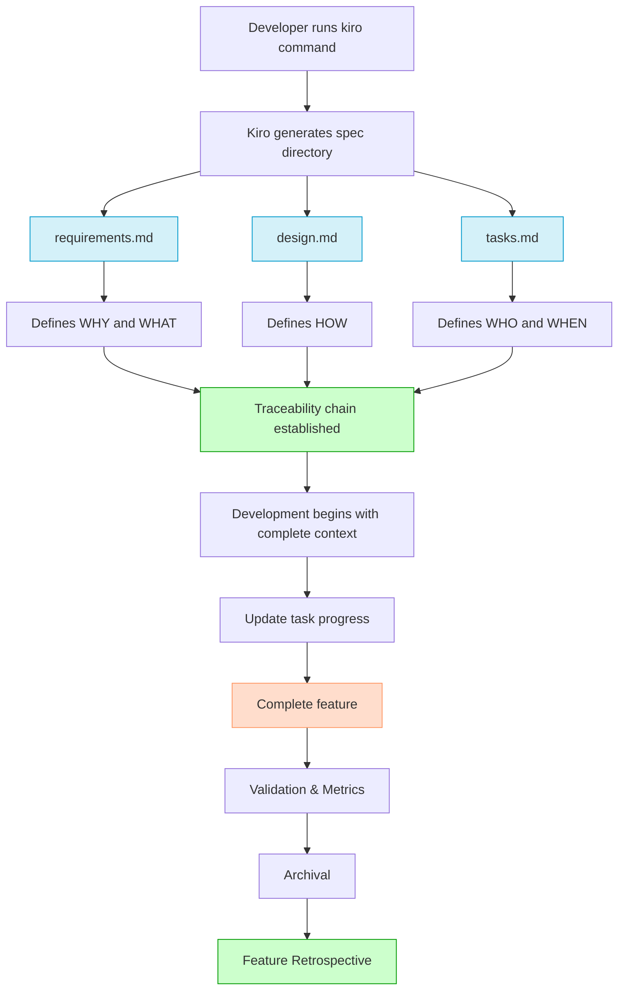
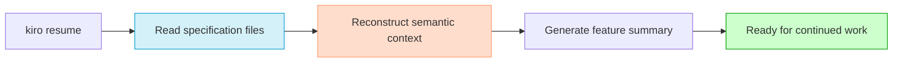
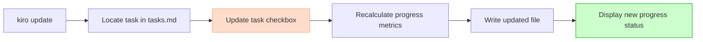
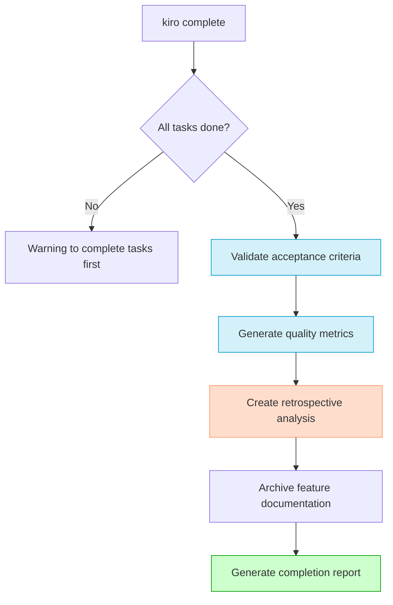
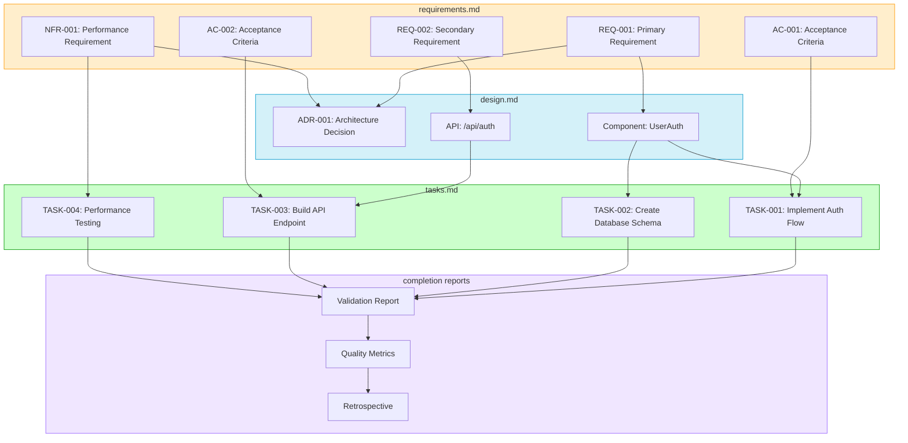

# 🤖 Kiro Agent - Traceable Agentic Development (TAD)

> **Kiro** brings structure, traceability, and consistency to your development workflow by automating the creation of high-quality specification documents and managing the entire feature lifecycle.

## What is TAD?

**Traceable Agentic Development (TAD)** is a methodology where every piece of work is semantically linked to clear requirements and deliberate design decisions, creating a complete traceability chain from concept to implementation and completion.

## 🌟 Key Benefits

| Benefit | Description |
|---------|-------------|
| 📝 **Automatic Documentation** | Generate comprehensive specs in seconds |
| 🔄 **Complete Traceability** | Every task links back to design and requirements |
| 🧠 **Context Preservation** | Reload feature context at any time |
| 🔍 **Built-in Verification** | Validate traceability before coding begins |
| 📊 **Progress Tracking** | Monitor task status and feature completion |
| 📈 **Smart Completion** | Validate, measure, and archive completed features |

## 📊 How Kiro Works



## 🚀 Getting Started

### Prerequisites

- **Google Gemini CLI**: Kiro runs within the Gemini CLI environment
- **Unix-like Terminal**: Compatible with bash or zsh shells

### Installation in 3 Simple Steps

1. **Download the required files**
   
   Make sure you have the following files in your project folder:
   - [`kiro_tool.pny`](./kiro_tool.pny)
   - [`setup_kiro.sh`](./setup_kiro.sh)
   - [`GEMINI.md`](./GEMINI.md)

   You can check if they exist with:
   ```bash
   # Make sure all files are in your project folder
   ls kiro_tool.pny setup_kiro.sh GEMINI.md
   ```

2. **Make the setup script executable**
   ```bash
   chmod +x setup_kiro.sh
   ```

3. **Run the installer**
   ```bash
   ./setup_kiro.sh
   ```

The script will:
- Create a tools directory (`~/gemini-tools/`)
- Move the Kiro tool there
- Add the `kiro` command to your shell configuration

### Activating the Command

After installation, activate the command by either:
- Opening a new terminal window, or
- Running: `source ~/.zshrc` (or `~/.bashrc` depending on your shell)

### **Setup GEMINI.md**

The `GEMINI.md` file is crucial for the Kiro agent to understand the context of your project. It contains information about your project structure, development conventions, and other important details.

To create and initialize this file, run the following command in your terminal:

```bash
/init "Please run initialization while preserving the existing GEMINI.md content. Add project structure details without overwriting the Kiro workflow information."
```
This will create a `GEMINI.md` file in your project's root directory. The Kiro agent will then use this file to generate more accurate and relevant specifications for your features.

## 💡 Using Kiro

Kiro now supports a complete feature lifecycle with four powerful commands:

### 1. Creating a New Feature

```bash
kiro "User Authentication with Two-Factor Auth"
```

This command performs the following actions:

```mermaid
flowchart LR
    A[kiro command] --> B[Create directory structure]
    B --> C[Generate requirements.md]
    C --> D[Generate design.md]
    D --> E[Generate tasks.md]
    E --> F[Run comprehensive verification]
    F --> G[GEMINI.md update assessment]
    G --> H[Display summary reports]

    style C fill:#d4f1f9,stroke:#0099cc
    style D fill:#d4f1f9,stroke:#0099cc
    style E fill:#d4f1f9,stroke:#0099cc
    style F fill:#ffddcc,stroke:#ff9966
    style H fill:#ccffcc,stroke:#009900
```



The verification process now includes:
- Forward, backward, and bi-directional traceability analysis
- Confidence scoring of requirements, design, and tasks
- Gap analysis to identify missing coverage
- Risk assessment with mitigation recommendations

### 2. Resuming Work on a Feature

To reload the context of an existing feature:

```bash
kiro resume "User Authentication with Two-Factor Auth"
```

This command:



### 3. Updating Task Status (NEW!)

Track progress by updating task status:

```bash
kiro update "User Authentication with Two-Factor Auth" --task_id TASK-abc123-001 --status done
```

Supported statuses:
- `done` - Task is completed
- `in-progress` - Work has started on this task
- `blocked` - Task is blocked by dependencies or issues

This command automatically updates the progress metrics in the tasks.md file:



### 4. Completing a Feature (NEW!)

When all tasks are complete, run the smart completion process:

```bash
kiro complete "User Authentication with Two-Factor Auth"
```

This comprehensive process:



The smart completion process generates:
1. **Validation Report**: Verifies all acceptance criteria are satisfied
2. **Quality Metrics**: Measures requirement satisfaction, code quality, test coverage, etc.
3. **Retrospective**: Analyzes what went well, what could be improved, and lessons learned
4. **Archival**: Moves all documentation to `specs/done/` with standardized naming
5. **Completion Report**: Summarizes the feature's implementation and quality

## 📁 Generated Documentation Structure

```
specs/
└── user-authentication-with-two-factor-auth/
    ├── requirements.md  # The WHY and WHAT
    ├── design.md        # The HOW
    └── tasks.md         # The execution plan with progress tracking

specs/done/
└── DONE_20250818_a1b2c3d4_*  # Archived completed features
    ├── requirements.md
    ├── design.md
    ├── tasks.md
    ├── validation.md
    ├── metrics.md
    └── retrospective.md
```

### Document Purposes

| Document | Purpose | Contains |
|----------|---------|----------|
| **requirements.md** | Defines the feature's intent | Functional/non-functional requirements, acceptance criteria |
| **design.md** | Outlines the implementation approach | Architecture decisions, component designs, API specifications |
| **tasks.md** | Provides execution blueprint | Actionable tasks linked to design elements, progress tracking |
| **validation.md** (on completion) | Verifies implementation | Acceptance criteria validation, coverage analysis |
| **metrics.md** (on completion) | Measures quality | Satisfaction scores, quality assessment, test coverage |
| **retrospective.md** (on completion) | Captures lessons learned | Successes, improvements, insights for future features |

## 🔄 Traceability Visualization



## 🛠️ Phase 2: Lifecycle Management

Kiro now supports the complete feature lifecycle with these additional capabilities:

### Task Status Tracking

- Update task statuses: `done`, `in-progress`, `blocked`
- Automatic progress calculation
- Visual indicators of feature completeness

### Smart Completion Process

When a feature is 100% complete, Kiro:

1. **Auto-validates acceptance criteria** against implementation
2. **Generates quality metrics** including:
   - Requirements satisfaction scores
   - Code quality assessment
   - Test coverage analysis
   - Risk mitigation effectiveness
3. **Creates a retrospective** identifying:
   - What went well
   - What could be improved
   - Lessons learned
   - Recommendations for future features
4. **Archives the feature** with standardized naming
5. **Produces a completion report** summarizing the feature's implementation

### GEMINI.md Update Assessment

After generating specifications, Kiro analyzes if GEMINI.md needs updating based on:

- New technology stack introductions
- Major architectural decisions
- New domain concepts
- Changes to development constraints

## 📜 Command Reference

| Command | Description | Example |
|---------|-------------|---------|
| `kiro "Feature Name"` | Generate new feature specs | `kiro "User Authentication"` |
| `kiro resume "Feature Name"` | Reload context | `kiro resume "User Authentication"` |
| `kiro update "Feature Name" --task_id ID --status STATUS` | Update task progress | `kiro update "User Authentication" --task_id TASK-abc-001 --status done` |
| `kiro complete "Feature Name"` | Run smart completion | `kiro complete "User Authentication"` |

## 🤝 Contributing

Contributions are welcome! Please feel free to submit a pull request or open an issue to discuss proposed changes.

## 📄 License

This project is licensed under the MIT License. See the `LICENSE` file for details.
