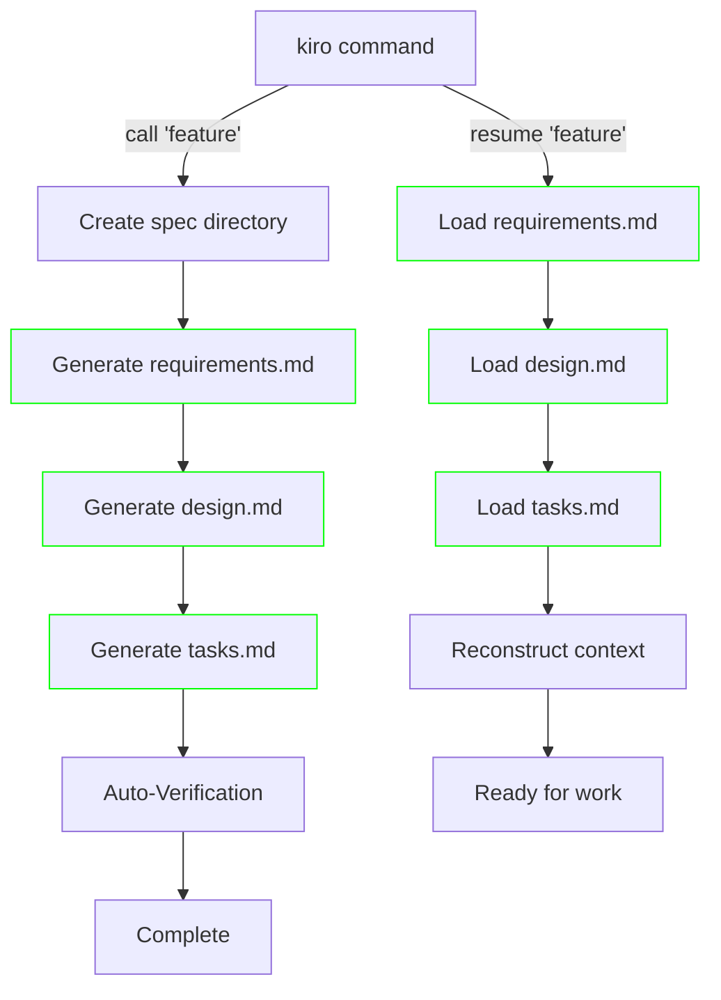

# Kiro Agent - Traceable Agentic Development (TAD)

Kiro is a command-line agent designed to bring structure, traceability, and consistency to the software development lifecycle. It automates the creation of essential specification documents for new features, ensuring that requirements, design, and tasks are semantically linked from day one.

This tool enforces the **Traceable Agentic Development (TAD)** methodology, where every piece of work is connected to a clear requirement and a deliberate design decision.

## ✨ Features

* **Automated Specification Generation**: Instantly create a full suite of specification documents (`requirements.md`, `design.md`, `tasks.md`) from a single command.

* **Semantic Traceability**: Automatically links tasks to design components and design components back to business requirements.

* **Simple CLI Interface**: A user-friendly `kiro` command that feels like a native part of your shell.

* **Context Persistence**: Use the `resume` command to reload the context of any feature, ensuring agents (and humans) have the full picture.

* **Automated Verification**: Includes a built-in AI check to validate traceability and assess architectural impact before you even start coding.

## 📋 Prerequisites

Before you begin, ensure you have the following installed and configured:

* **Google Gemini CLI**: The Kiro agent is a tool that runs within the Gemini CLI. You must have it installed and authenticated.

## 🚀 Installation

Installation is handled by a simple, interactive script.

1. **Download the Files**: Make sure you have both `kiro_tool.py` and `setup_kiro.sh` in your project folder.

2. **Make the Setup Script Executable**: Open your terminal in your project folder and run:

   ```
   chmod +x setup_kiro.sh
   ```

3. **Run the Installer**: Execute the script. It will guide you through the process.

   ```
   ./setup_kiro.sh
   ```

   The script will automatically detect your shell (bash or zsh), move the tool to a permanent location (`~/gemini-tools/`), and add the `kiro` command to your shell's configuration file (`.zshrc` or `.bashrc`).

4. **Reload Your Shell**: To activate the new `kiro` command, either open a new terminal window or run the `source` command suggested by the script. For example:

   ```
   source ~/.zshrc
   ```

## Usage

The `kiro` agent is now ready to use directly from your command line.

### Creating a New Feature

To generate the full set of specifications for a new feature, use the `kiro` command followed by the feature name in quotes.

```
kiro "User Authentication with Two-Factor Auth"
```

This command will:

1. Create a new directory: `specs/user-authentication-with-two-factor-auth/`

2. Generate `requirements.md`, `design.md`, and `tasks.md` inside it.

3. Run an automated verification and print a summary report to your console.

### Resuming Work on a Feature

If you need to work on an existing feature, the `resume` command loads its context. This is useful for ensuring an AI agent has all the necessary background before you give it a new instruction.

```
kiro resume "User Authentication with Two-Factor Auth"
```

This command will read the three specification files and provide a summary of the project's current state, intent, and progress.

## ⚙️ How It Works

1. **The Setup Script (`setup_kiro.sh`)**: This script is a one-time installer that configures a shell function in your environment.

2. **The `kiro` Shell Function**: This function acts as a user-friendly shortcut. When you type `kiro "..."`, it translates your input into the full, complex command required to run the Gemini tool.

3. **The Python Tool (`kiro_tool.py`)**: This is the core of the agent. It defines the logic for the `call` and `resume` commands and contains the prompts used by the Gemini model to generate the content for each of the specification files.

## Workflow Diagram



## 📂 Generated File Structure

When you run the `kiro` command, it produces the following traceable documents:

* `specs/{feature-name}/`

  * **`requirements.md`**: The semantic anchor. Defines the *why* and *what* of the feature, including functional/non-functional requirements and acceptance criteria.

  * **`design.md`**: The architectural mirror. Outlines the *how*, detailing architectural decisions (ADRs), new/modified components, and API designs that fulfill the requirements.

  * **`tasks.md`**: The execution blueprint. Breaks down the design into actionable, traceable tasks, each linked back to design elements and requirements.

## 🤝 Contributing

Contributions are welcome! Please feel free to submit a pull request or open an issue to discuss proposed changes.

## 📄 License

This project is licensed under the MIT License. See the `LICENSE` file for details.
            