# 🤖 Kiro Agent - Traceable Agentic Development (TAD)

> **Kiro** brings structure, traceability, and expert delegation to your development workflow. It automates the creation of high-quality specification documents and leverages a vast library of specialist personas to execute tasks.

## What is TAD?

**Traceable Agentic Development (TAD)** is a methodology where every piece of work is semantically linked to clear requirements and deliberate design decisions. It uses EARS (Easy Approach to Requirements Syntax) for precision and leverages a library of specialist **Personas** with **Stateful Persona Delegation** to ensure the right agent is assigned to every task, creating a complete traceability chain from concept to implementation.

## 🌟 Key Benefits

| Benefit | Description |
|---|---|
| 📝 **Automatic Documentation** | Generate comprehensive specs in seconds with EARS syntax and intelligent context awareness |
| 🤖 **Expert Delegation** | Automatically assign tasks to a library of 295+ specialist personas |
| 🔄 **Complete Traceability** | Every task links back to design and requirements with semantic connections |
| 🧠 **Context Preservation** | Reload complete feature context at any time with optimized token usage |
| 🔍 **Built-in Verification** | Validate traceability before coding begins with smart checks |
| 📊 **Progress Tracking** | Monitor task status and feature completion with EARS compliance |
| 📈 **Smart Completion** | Validate, measure, and archive completed features with quality metrics |
| 🎭 **Stateful Persona Delegation** | Automatically assign and track tasks to specialist personas, ensuring expertise and continuity |

## 🙏 Special Thanks to @davepoon

The powerful Persona Delegation feature is made possible by the incredible work of community hero **@davepoon**. Their brilliant `claude-code-subagents-collection` provides the vast library of over 150 specialized agents that Kiro uses to delegate tasks.

**Please support their invaluable contribution:**
- 🌟 **Star the repository**: [davepoon/claude-code-subagents-collection](https://github.com/davepoon/claude-code-subagents-collection)
- 🙏 Show your appreciation for their work in making enhanced AI development possible.

## 🚀 Getting Started

### Prerequisites

* **Google Gemini CLI**: Install and configure the Gemini CLI on your system
* **Unix-like Terminal**: Compatible with bash or zsh shells

### Option 1: 🌍 Global Installation (Recommended)

Install Kiro commands globally to use in any project with Gemini CLI:

```bash
# Clone the repository
git clone https://github.com/bizzkoot/kiro_style_claude_code.git
cd kiro_style_claude_code/gemini-tools

# Run global installation script (installs Kiro commands and Persona Library)
./gemini-install-global.sh

# Clean up
cd .. && rm -rf kiro_style_claude_code
```

**✨ Now use Kiro in any project with Gemini CLI:**
```bash
cd any-project/
gemini
/kiro-init  # Sets up Kiro workflow automatically
```

**🗑️ To uninstall globally:**
```bash
# Download and run uninstaller
curl -sSL https://raw.githubusercontent.com/bizzkoot/kiro_style_claude_code/main/gemini-tools/gemini-uninstall-global.sh | bash

# Or clone and run locally
git clone https://github.com/bizzkoot/kiro_style_claude_code.git
cd kiro_style_claude_code/gemini-tools
./gemini-uninstall-global.sh
cd .. && rm -rf kiro_style_claude_code
```

---

### Option 2: 📁 Per-Project Installation

Choose one of these methods for individual projects:

**Method A: Manual Installation**
```bash
# Create project commands directory
mkdir -p .gemini/commands/
mkdir -p .gemini/templates/

# Copy files to project directory (assuming you're in the gemini-tools directory)
cp kiro.toml .gemini/commands/
cp kiro-init.toml .gemini/commands/
cp kiro_template.md .gemini/templates/
```

**Method B: Clone and Copy**
```bash
# Clone the repository
git clone https://github.com/bizzkoot/kiro_style_claude_code.git

# Copy required files to your project directory
mkdir -p .gemini/commands .gemini/templates
cp kiro_style_claude_code/gemini-tools/kiro.toml .gemini/commands/
cp kiro_style_claude_code/gemini-tools/kiro-init.toml .gemini/commands/
cp kiro_style_claude_code/gemini-tools/kiro_template.md .gemini/templates/

# Clean up
rm -rf kiro_style_claude_code
```

## 💡 How to Use Kiro with Gemini CLI

Kiro operates as an intelligent command for the Gemini CLI using a TOML-based system prompt with integrated persona delegation. The system automatically selects from 150+ specialist personas to handle different aspects of your development workflow. No complex setup or servers required!

### 🚀 Initialize Gemini CLI (Per-Project Only)

For per-project installations, start with project setup:
```bash
# Start the Gemini CLI
gemini

# Initialize new project with Kiro workflow and persona library
/kiro-init
```

> **💡 Why this matters:** This copies the Kiro template to your project and sets up the directory structure for specification-driven development with persona delegation support.

### Using the /kiro Command with Persona Delegation

After initialization, use the main `/kiro` command. The system will automatically generate specifications AND assign specialist personas to each task:

```bash
# Start the Gemini CLI (if not already running)
gemini

# Use the kiro command - it will generate specs AND persona assignments
/kiro "User Authentication System with two-factor authentication"
```

**What happens automatically:**
1. **Requirements Analysis** - Generated with EARS syntax
2. **Design Architecture** - Created with behavioral contracts
3. **Persona Assignment** - Each task automatically assigned to specialist (e.g., security-expert, database-architect, frontend-developer)
4. **Task Execution** - When you work on tasks, the system loads the assigned specialist persona

### Command Examples

#### 1. Project Initialization (For New Projects)
Set up Kiro workflow in your project:
```
/kiro-init
```

#### 2. Creating a New Feature with Automatic Persona Assignment
Generate comprehensive specification documents with EARS syntax and persona delegation:
```
/kiro "User Authentication with Two-Factor Auth supporting SMS and authenticator apps"
```
**Generated files:**
- `requirements.md` - EARS-formatted requirements
- `design.md` - Technical architecture
- `persona-delegation.json` - Maps each task to specialist personas
- `tasks.md` - Implementation checklist

#### 3. Resuming Work with Persona Context
Continue work on an existing feature with full persona context:
```
/kiro resume "User Authentication" 
```
**What happens:**
- Loads complete feature context
- Identifies next pending task
- Automatically adopts the assigned specialist persona
- Continues implementation with expert knowledge

#### 4. Complex Feature with Context
Provide detailed context for better specifications:
```
/kiro "Real-time Collaboration System with document editing, user presence, and conflict resolution"
```

## 📚 Advanced Usage Patterns

### Intelligent Persona Selection for Complex Features
When describing complex features, provide structured context. The system will analyze requirements and assign appropriate specialists:
```
/kiro "Payment Processing System with the following considerations:
1. Core functionality: Stripe integration, multiple payment methods, subscription billing
2. User experience: One-click payments, saved payment methods, receipt management
3. Integration points: Connect to existing user accounts, notification service, accounting system
4. Technical constraints: PCI compliance, fraud detection, international currency support"
```

**Automatic Persona Assignment Example:**
- Stripe integration → `payment-integration` specialist
- PCI compliance → `security-auditor` specialist  
- Database design → `database-architect` specialist
- Frontend UX → `ui-ux-designer` specialist
- API design → `backend-architect` specialist

### EARS-Enhanced Specifications
The kiro command automatically generates specifications with EARS syntax:
- **WHEN** [trigger condition], the system **SHALL** [specific action]
- **WHILE** [ongoing state], the system **SHALL** [continuous behavior]  
- **IF** [conditional state], the system **SHALL** [conditional response]
- **WHERE** [constraint boundary], the system **SHALL** [bounded action]

### Stateful Persona Delegation
To continue work on an existing feature with persona context:
```
/kiro resume "Feature Name"
```

**Stateful Benefits:**
- **Consistency**: Same specialist handles related tasks
- **Context Preservation**: Specialist knowledge maintained across sessions
- **Quality Assurance**: Each persona brings domain expertise
- **Traceability**: Clear record of who worked on what

## 📋 Command Reference with Persona Integration

| Command | Purpose | Persona Features | Example |
|---|---|---|---|
| `/kiro-init` | Initialize new project with Kiro template and persona library | Sets up 150+ specialist personas | `/kiro-init` |
| `/kiro "Feature Name"` | Generate specifications + persona assignments | Auto-assigns tasks to specialists | `/kiro "User Dashboard"` |
| `/kiro resume "Feature Name"` | Resume work with persona context | Loads assigned specialist for next task | `/kiro resume "Payment System"` |
| Natural language follow-ups | Task updates, completion, etc. | Maintains persona context | "Mark task TASK-001 as completed" |

## 🗂️ Generated Documentation Structure

```
specs/
└── user-authentication-with-two-factor-auth/
    ├── requirements.md  # The WHY and WHAT with EARS syntax
    ├── design.md        # The HOW with EARS behavioral contracts
    ├── persona-delegation.json # The WHO - maps tasks to specialist personas
    └── tasks.md         # The execution plan with EARS DoD

specs/done/
└── DONE_20250818_a1b2c3d4_.../  # Archived completed features
    ├── requirements.md
    ├── design.md
    ├── persona-delegation.json
    ├── tasks.md
    ├── validation.md
    ├── metrics.md
    └── retrospective.md
```

## 🔧 Development Workflow with Persona Delegation

```mermaid
graph TB
    A["/kiro 'Feature Name'"] --> B{Generate Specifications}
    B --> C[requirements.md<br/>📋 EARS Requirements + MVP Scoping]
    B --> D[design.md<br/>🏗️ Architecture & ADRs]
    B --> E[persona-delegation.json<br/>👥 Task-to-Specialist Mapping]
    
    C --> G[👤 User Review & Approval]
    D --> G
    E --> G
    
    G --> H{Requirements & Design Approved?}
    H -->|No| I[🔄 Revise & Re-approve]
    I --> G
    H -->|Yes| J[🎯 Phase 4.5: MVP Optimization Review]
    
    J --> K{Complexity Assessment}
    K --> L[📊 Generate Optimization Report<br/>• Simple Tasks: <200 tokens<br/>• Medium Tasks: 200-500 tokens<br/>• Complex Tasks: >500 tokens - FLAGGED]
    L --> M[tasks.md<br/>✅ Implementation Checklist + MVP Context]
    
    M --> N[👤 User Review: Tasks + Optimization]
    N --> O{Tasks Approved?}
    O -->|Complex Tasks Flagged| P[🔧 Simplify Over-engineered Tasks]
    P --> N
    O -->|Yes| Q[🚀 Begin Implementation]
    
    Q --> R[📋 Select Next Task]
    R --> S[🤖 Consult persona-delegation.json]
    S --> T[👨‍💻 Adopt Specialist Persona]
    T --> U[💡 Inject MVP Context<br/>• Token Budget<br/>• Pattern Preference<br/>• Complexity Constraints]
    U --> V[⚡ Execute with MVP Guidelines]
    
    V --> W{Task Complete?}
    W -->|No| X[🔄 Continue Implementation]
    X --> V
    W -->|Yes| Y[✅ Mark Task Complete]
    
    Y --> Z{More Tasks?}
    Z -->|Yes| R
    Z -->|No| AA[🔍 Expert Validation]
    
    AA --> BB[📦 Archive to specs/done/]
    BB --> CC[🎉 Feature Complete!]
    
    style A fill:#1976d2,stroke:#0d47a1,stroke-width:2px,color:#ffffff
    style B fill:#7b1fa2,stroke:#4a148c,stroke-width:2px,color:#ffffff
    style C fill:#f57c00,stroke:#e65100,stroke-width:2px,color:#ffffff
    style D fill:#f57c00,stroke:#e65100,stroke-width:2px,color:#ffffff
    style E fill:#388e3c,stroke:#1b5e20,stroke-width:2px,color:#ffffff
    style J fill:#ff6f00,stroke:#e65100,stroke-width:2px,color:#ffffff
    style L fill:#ff6f00,stroke:#e65100,stroke-width:2px,color:#ffffff
    style M fill:#f57c00,stroke:#e65100,stroke-width:2px,color:#ffffff
    style T fill:#c2185b,stroke:#880e4f,stroke-width:2px,color:#ffffff
    style U fill:#ff6f00,stroke:#e65100,stroke-width:2px,color:#ffffff
    style AA fill:#0277bd,stroke:#01579b,stroke-width:2px,color:#ffffff
    style CC fill:#388e3c,stroke:#1b5e20,stroke-width:2px,color:#ffffff
```



### Phase 1: Specification & Persona Assignment
1. Use `/kiro "Feature Name"` to generate specification documents with MVP scoping:
   - `requirements.md` - EARS-formatted requirements with MVP boundaries
   - `design.md` - Technical architecture with optimization focus
   - `persona-delegation.json` - Task-to-specialist mapping
2. Review and approve requirements and design documents
3. **Phase 4.5: MVP Optimization Review** - Complexity assessment and over-engineering prevention
4. Generate `tasks.md` with MVP context, token budgets, and complexity classifications
5. Review tasks and optimization assessment for final approval

### Phase 2: MVP-Guided Delegated Implementation  
1. For each task, the system automatically:
   - Consults `persona-delegation.json` for specialist assignment
   - Adopts the assigned specialist persona
   - **Injects MVP optimization context** (token budget, pattern preference, complexity constraints)
   - Executes with domain expertise under MVP guidelines
2. Update task status using natural language ("Mark TASK-001 as completed")
3. Verify implementation against EARS acceptance criteria with complexity validation

### Phase 3: Expert Validation & Completion
1. Ensure all tasks are marked complete with MVP compliance
2. Run quality validation with appropriate specialists
3. Archive completed feature documentation with persona attribution and optimization metrics

## 🎯 EARS + Persona Integration Benefits

### EARS Precision:
- **Eliminates Ambiguity**: "WHEN user clicks login, system SHALL authenticate within 200ms" vs "fast login"
- **Direct Test Translation**: EARS → BDD (Given/When/Then) mapping for automated testing  
- **Behavioral Contracts**: Component interfaces specify exact behavioral expectations
- **Measurable Success**: Every requirement has specific triggers and measurable outcomes
- **Comprehensive Coverage**: Every acceptance criterion maps to testable conditions

### Persona Delegation Benefits:
- **Expert Execution**: Each task handled by specialist with domain knowledge
- **Quality Assurance**: Domain experts reduce bugs and improve architecture
- **Consistent Patterns**: Specialists follow established best practices
- **Knowledge Transfer**: Learn from expert implementation approaches
- **Scalable Team**: Access 295+ specialists without hiring costs

### MVP Optimization Benefits:
- **Over-Engineering Prevention**: Built-in complexity gates flag tasks >500 tokens for review
- **Pattern Reuse**: Enforces preference for existing components over custom solutions
- **Pragmatic Validation**: Meet EARS criteria with simplest working solution
- **Token Efficiency**: Budget-aware development prevents scope creep
- **Quality Control**: Optimization assessment at every approval gate

## 🌟 Global Installation Benefits

**✨ Advantages of Global Installation:**
- 🚀 **Instant Access** - Use Kiro commands in any project without setup
- 🔄 **Consistent Experience** - Same workflow across all your projects  
- 🛠️ **Easy Management** - Single install/uninstall for all projects
- 💾 **No Duplication** - Saves disk space by avoiding file copies
- 🔧 **Easy Updates** - Update once, affects all projects
- 📋 **Template Reuse** - Shared templates across projects

**🎯 Perfect for:**
- Developers working on multiple projects
- Teams standardizing on Kiro methodology
- Quick prototyping and experimentation
- Maintaining consistency across codebases

## 📖 Additional Resources

- [kiro_template.md](./kiro_template.md) - Detailed template and examples for Gemini CLI
- [kiro.toml](./kiro.toml) - The main Kiro command specification file
- [kiro-init.toml](./kiro-init.toml) - Project initialization command file
- [gemini-install-global.sh](./gemini-install-global.sh) - Global installation script
- [gemini-uninstall-global.sh](./gemini-uninstall-global.sh) - Global uninstallation script

## 🤝 Contributing

To modify or extend the Gemini Kiro commands:
1. Edit the relevant `.toml` files (`kiro.toml`, `kiro-init.toml`)
2. Update the prompt sections with your improvements
3. Test your changes with per-project installation first
4. For global changes, update the installation scripts:
   - Modify `gemini-install-global.sh` for installation updates
   - Modify `gemini-uninstall-global.sh` for uninstallation updates
5. Reinstall using the appropriate method (global or per-project)